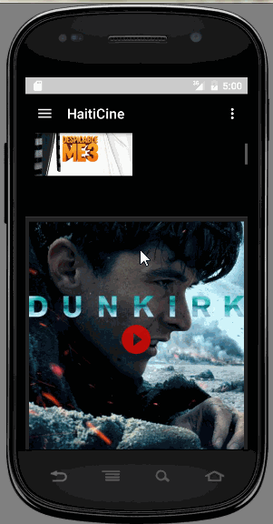

# HaitiCine

Completed user stories:  

[x] require: User can view a list of movies require: Views is responsive for both landscape/portrait mode and fully optimized for performance with the ViewHolder pattern.  
[x] In portrait mode, the poster image, title, and movie overview is shown.  
[x] In landscape mode, the rotated layout should use the backdrop image instead and show the title and movie overview to the right of it.  
[x] Advance : i add a icon on the screen!  
[x] Advance: i pull-to-refresh for popular stream with SwipeRefreshLayout Advance: 
[x] improve the user interface through styling and coloring GIF created with LiceCap. 

